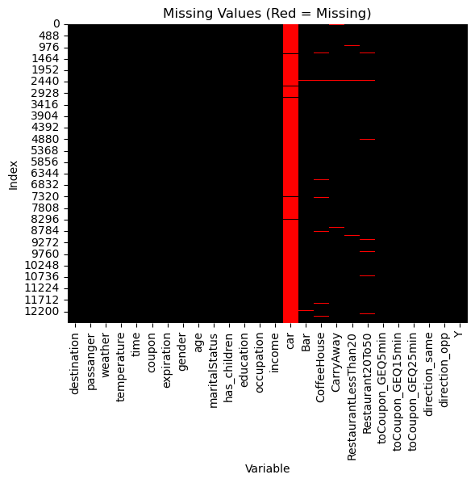
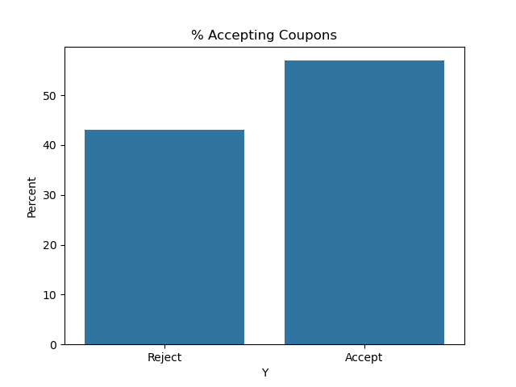
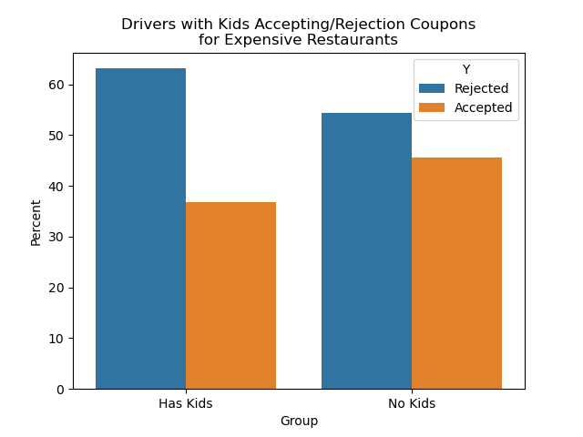

# Practical Application Assignment #1

## Link to Jupyter Notebook

[coupon_analysis.ipynb](coupon_analysis.ipynb)

## EDA

- Missing values were present in 6 columns
- The cars column had a large amount of missing values and was dropped.
- The remaining 5 columns had a very small percentage of missing values.
- The remainder of examples with missing values were dropped as they were
  a small percentage of the overall dataset.
- The temperature column has only three distinct values, which suggests
  that it is not very precise

## Findings

- 57% of drivers accepted coupons
- Coffee House coupon were the most frequently offered.

### Bar Coupons

- ~59% of Bar coupons were accepted
- Those who went to a bar more than 3 times per month
  were much more likely to accept bar coupons
- Driver over 25 and going to the bar more than once a month
  were also very likely to accept coupons
- Drivers who had passengers that were not kids, and who occupation
  was not in farming, fishing, or forestry were also mor likely to
  accept coupons
- Those who go to bars more than once a month, and had passengers that were
  not a kid, and were not widowed were likely to accept coupons
- Those who go to bars more than once a month and are under the age of 30
  were also likely to accept coupons

### Expensive Restaurant Coupons

- Those who have kids are marginally less likely to accept coupons
  for more expensive restaurants.

## Next Steps

- Target offering Bar coupons to the those who visit the bar frequently
- Maybe offer less expensive or coupons for kid friendly restaurants to
  those with kids
- Further investigation into the types of coupons that are accepted most
  by those with kids could be next steps.
